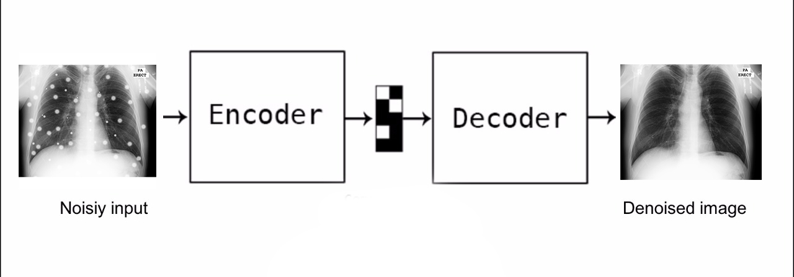

# Image Denoising

Image Denosing is the process of removing the random noise from the image such as random variation of brightness or color information in images, and is usually an aspect of electronic noise. Reserving the details of an image and removing the random noise as far as possible is the goal of image denoising approaches

# Denoising Approach

We took the approach of Autoencoder. An autoencoder is a type of artificial neural network used to learn efficient data codings in an unsupervised manner. The aim of an autoencoder is to learn a representation (encoding) for a set of data, typically for dimensionality reduction, by training the network to ignore signal “noise”.

## Getting Started

This model neeeds to be run on local machine with Python and it's libraries pre-installed, or a clound with the same setup

## Prerequisites

'''pip install tensorflow
   pip install keras
   pip install numpy
   pip install PIL
   pip install IPython
'''

After install we can import and make use
'''import tensorflow as tf
   import keras as k
'''

# Deployment

We used Jupyter Notebook to deploy our model with the help of supporting libraries

# Procedure

